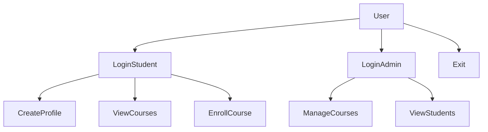
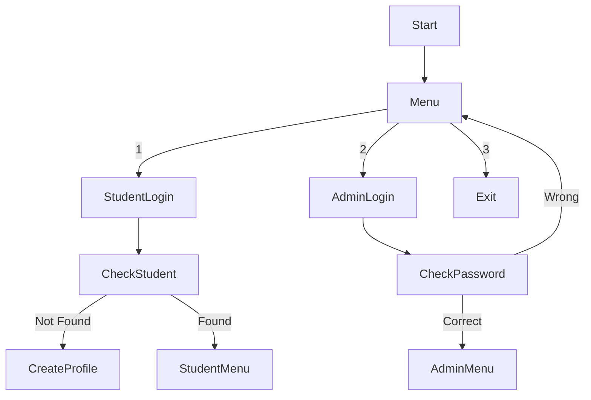

# unknownapp
This is an unknown application written in Java

---- For Submission (you must fill in the information below) ----
### Use Case Diagram

### Flowchart of the main workflow

### Prompts

- "Explain what this Java enrollment system does"
- "Identify the main functionality of a Java console application"
- "Convert a Java student login system to Python"
- "Create a flowchart for a login menu system"
- "Generate a use case diagram for a course enrollment system"
